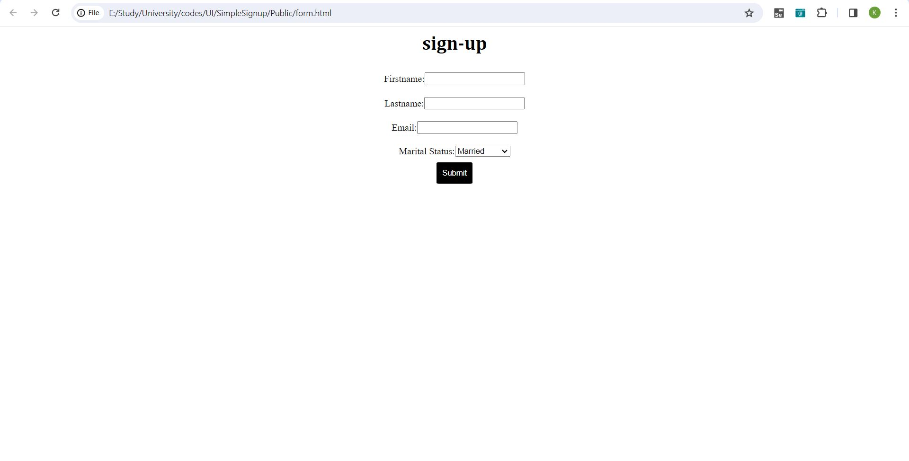

<!DOCTYPE html>
<html lang="en">
<head>
    <meta charset="UTF-8">
    <meta name="viewport" content="width=device-width, initial-scale=1.0">
</head>
<body>

<header>
        <h1>Signup Page Project</h1>
        
A simple web application for user signup with validation and MySQL integration.

</header>

<section>
        <h2>Description</h2>
        
This project is a basic web application that allows users to sign up using a form. It includes frontend validation using JavaScript, a Node.js server to handle form submissions, and MySQL database integration for storing user data.

</section>

<section>
        <h2>Features</h2>
        <ul>
            <li>Responsive signup form with basic user information fields.</li>
            <li>Client-side validation using JavaScript.</li>
            <li>Server-side handling of form submissions with Node.js and Express.</li>
            <li>Data storage in a MySQL database using a simple API.</li>
        </ul>
</section>

<section>
        <h2>Project Structure</h2>
        <ul>
            <li><code>public/</code>: Contains HTML, CSS, and JavaScript files for the frontend.</li>
            <li><code>public/JS/</code>: JavaScript files, including form validation and AJAX handling.</li>
            <li><code>app.js</code>: Node.js server script using Express for handling requests.</li>
            <li><code>API.js</code>: Express router for handling form submissions and interacting with MySQL.</li>
            <li><code>connection.js</code>: MySQL connection setup.</li>
            <li><code>form.css</code>: Stylesheet for the signup form.</li>
            <li><code>JS/validating.js</code>: JavaScript file for form validation.</li>
        </ul>
</section>

<section>
        <h2>Setup</h2>
        <ol>
            <li>Clone the repository: <code>git clone https://github.com/kiarashrahmani/SimpleSignup.git</code></li>
            <li>Install dependencies: <code>npm install</code></li>
            <li>Start the server: <code>node app.js</code></li>
            <li>Visit <code>http://localhost:3000/</code> in your browser to access the signup page.</li>
        </ol>
</section>

<section>
        <h2>Contributing</h2>
        
Contributions are welcome! Fork the repository, create a new branch, make your changes, and submit a pull request.

</section>

<section>
        <h2>Screenshot</h2>
        </img>
</section>

<section>
        <h2>License</h2>
        
This project is licensed under the MIT License - see the <a href="LICENSE">LICENSE</a> file for details.

</section>

 <footer>
        
Feel free to reach out if you have any questions or issues!

</footer>

</body>
</html>
